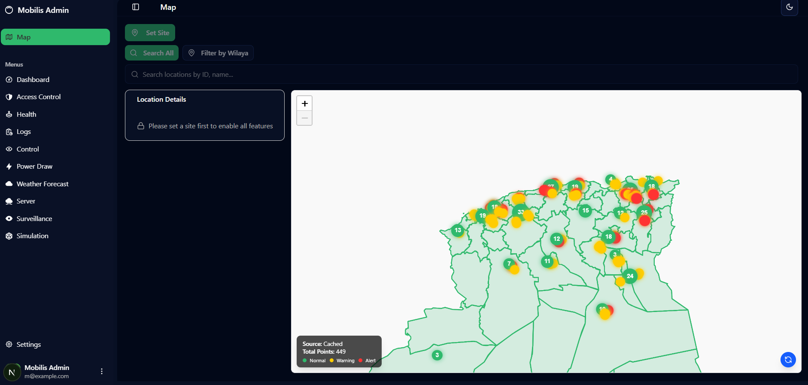
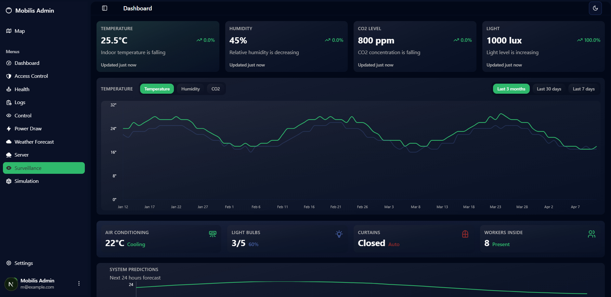
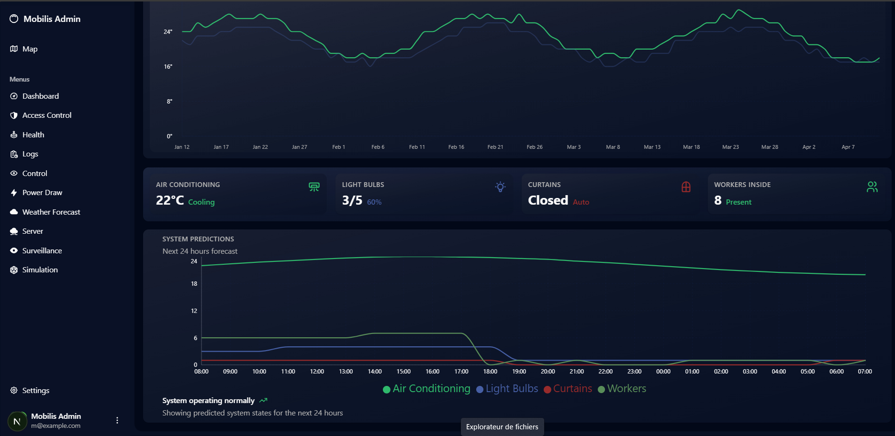
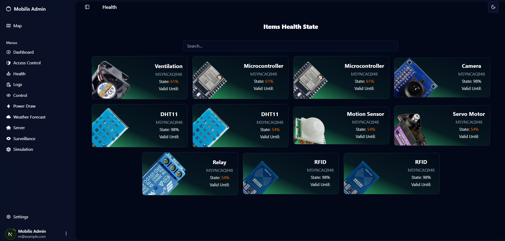
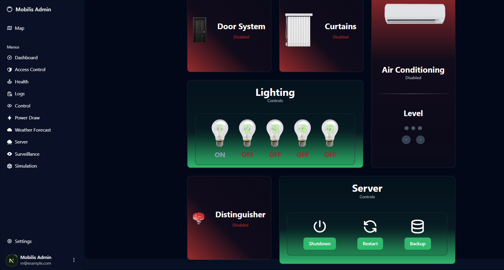

# Smart Server Center Monitoring & Control System Documentation

## Overview
This system provides a real-time monitoring and control platform for server centers (callrooms). It is built using Raspberry Pi hardware, secure MQTT communication, and a modern web dashboard built with Next.js. The platform enables continuous tracking, real-time visualization, and remote management of environmental and security parameters within each server room.

---

## System Architecture

### 1. Hardware Layer
- **Device**: Raspberry Pi  
- **Sensors**: Temperature, humidity, motion, smoke detectors  
- **Actuators**: Fans, alarms, LEDs (for visual indicators)  
- **Connectivity**: Devices connect to the network and communicate via the MQTT protocol

### 2. Communication Layer
- **Protocol**: MQTT (Message Queuing Telemetry Transport)  
- **Security**: Encrypted transmission (TLS/SSL)  
- **Broker**: Secure and private MQTT broker handling publish/subscribe events

### 3. Backend Services
- **Database**: Supabase (PostgreSQL)  
- **Authentication**: Supabase Auth  
- **Realtime Updates**: Supabase Realtime or MQTT-integrated updates

### 4. Web Dashboard (Frontend)
- **Framework**: Next.js  
- **Data Visualization**: Recharts  
- **Design**: Tailwind CSS  
- **Features**:
  - Interactive map of callrooms  
  

  - Real-time temperature and humidity charts  
    
    

  - System status indicators (alerts, anomalies)  
      

  - Remote management controls 
      

  - User login, profile editing, and access management
      

---

## Features

### Callroom Map Interface
- Displays each callroom’s location and live status  
- Color-coded indicators for temperature and alert levels

### Realtime Sensor Monitoring
- Displays live temperature, humidity, and other sensor data  
- Charted using Recharts with real-time updates

### Remote Control
- Admins can activate/deactivate devices (fans, alarms)  
- Secure commands sent via MQTT to Raspberry Pi controllers

